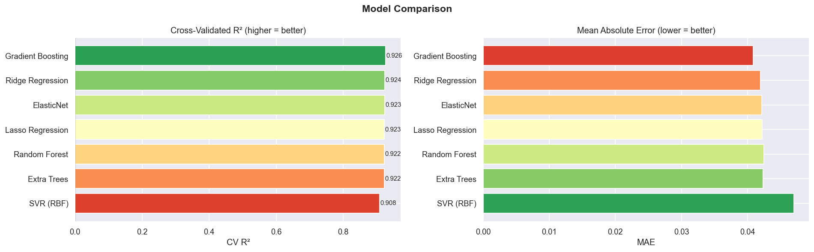
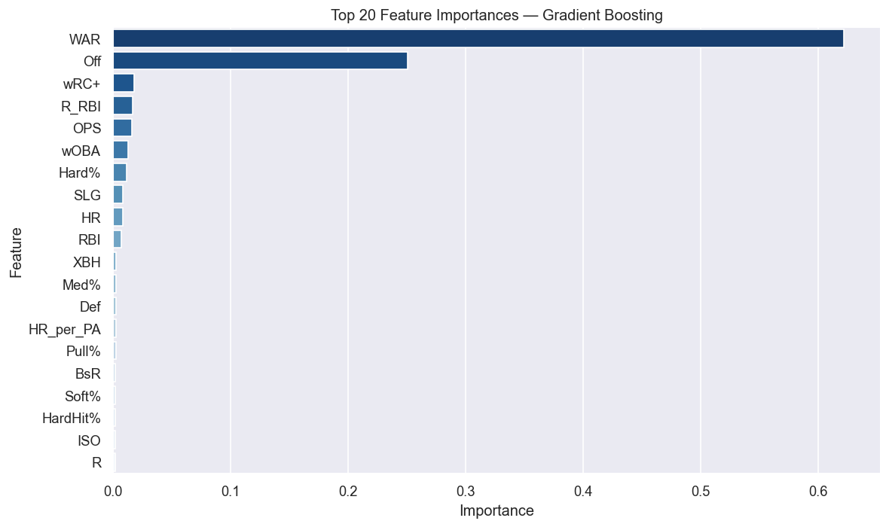
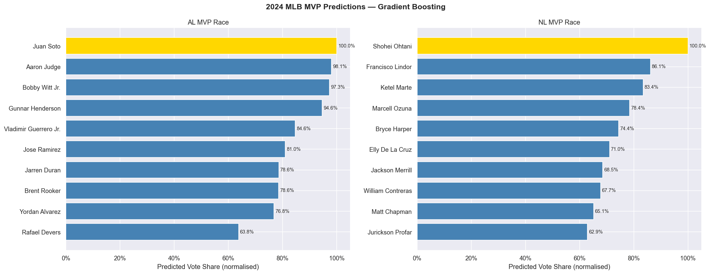
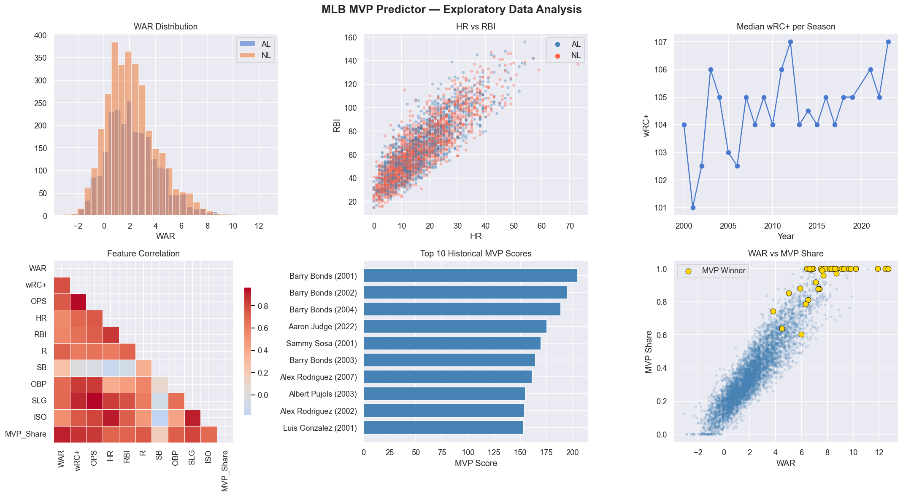

# MLB MVP Predictor — Run Report (2000–2024)

This report summarizes the current state of the **MLB MVP Predictor** project, including how the model is built, what techniques are used, and the latest results produced by running `mlb_mvp_predictor.py`.

## Project goal

Use historical batting performance to **rank MVP candidates** and produce an estimated, *within-league* “vote share–like” score for a chosen season.

## Data

- **Source**: FanGraphs batting data via `pybaseball.batting_stats(...)`
- **Range pulled**: 2000–2024
- **Filtering**: hitters with at least **350 PA** (`MIN_PA = 350`)
- **League label**: inferred from team abbreviation (AL team set vs “otherwise NL”)

Latest run produced:

- **Raw**: 22,833 player-seasons × 320 columns
- **After filtering/cleaning**: 5,812 player-seasons across 24 seasons  
  - NL: 3,314 rows  
  - AL: 2,498 rows

## Feature engineering (what the model “sees”)

The notebook/script converts the FanGraphs tables into a modeling dataset by:

- **Cleaning numeric columns**: coerces to numeric and fills common missing stats with `0`
- **Adding derived features** such as:
  - **ISO** = SLG − AVG (power beyond singles)
  - **BB_K** = BB / (K + 1) (plate discipline proxy)
  - **XBH** = 2B + 3B + HR (extra-base hits)
  - **HR_per_PA** = HR / PA
  - **R_RBI** = R + RBI (counting-stat “production” proxy)

In the latest run, **32 features** were available and used.

## Target construction (important)

Because historical **actual MVP vote shares** aren’t used in this version, the project builds a proxy regression target:

1. Compute an **MVP_Score** as a weighted combination of WAR, wRC+, OPS, HR, RBI, runs, baserunning, and defense.
2. Convert that score to a **within (Season, League) normalized value**:
   - `MVP_Share` = min-max normalized MVP_Score per league-season, so it lands in \([0, 1]\)

This is a *ranking-style proxy* that encourages the model to learn “who looks most MVP-like” within each league and season.

## Modeling approach

This is treated as a **regression problem**:

- **Input**: the engineered player-season feature vector
- **Output**: predicted `MVP_Share` (0–1)

### Models trained

The script trains and compares:

- Ridge Regression (scaled)
- Lasso Regression (scaled)
- ElasticNet (scaled)
- SVR RBF (scaled)
- Random Forest
- Extra Trees
- Gradient Boosting

**XGBoost** is included only if it can import successfully. On this machine, it was skipped due to an OpenMP (`libomp`) issue.

### Evaluation

- **Train/test split**: 80/20 random split on all pre-2024 seasons
- **Cross-validation**: 5-fold CV on all training seasons (`KFold(shuffle=True)`)
- **Metrics**:
  - MAE (mean absolute error)
  - RMSE (root mean squared error)
  - \(R^2\)
  - CV \(R^2\) (mean across folds)

## Model comparison results (latest run)

| Model | MAE | RMSE | Test \(R^2\) | CV \(R^2\) |
|------|-----:|-----:|-------------:|-----------:|
| Ridge Regression | 0.0420 | 0.0584 | 0.9172 | 0.9236 |
| Lasso Regression | 0.0422 | 0.0592 | 0.9149 | 0.9226 |
| ElasticNet | 0.0421 | 0.0590 | 0.9155 | 0.9231 |
| SVR (RBF) | 0.0470 | 0.0634 | 0.9024 | 0.9084 |
| Random Forest | 0.0425 | 0.0575 | 0.9196 | 0.9222 |
| Extra Trees | 0.0424 | 0.0576 | 0.9194 | 0.9216 |
| **Gradient Boosting** | **0.0408** | **0.0563** | **0.9231** | **0.9261** |

**Selected best model**: **Gradient Boosting** (highest CV \(R^2\))

### Visual: model comparison

## Feature importance (best model)

The script produces a **top-20 feature importance** chart for the selected model.

## 2024 predictions (latest run)

Predictions are generated for `PREDICT_YEAR = 2024`. The script:

1. scores all qualified hitters in 2024, then
2. normalizes predictions **within each league** to \([0, 1]\) as `Pred_Norm`.

### American League — top 10

| Rank | Name | Team | PA | HR | RBI | R | AVG | OPS | wRC+ | WAR | Pred_Norm |
|---:|---|---|---:|---:|---:|---:|---:|---:|---:|---:|---:|
| 1 | Juan Soto | NYY | 713 | 41 | 109 | 128 | 0.288 | 0.989 | 181 | 8.3 | 1.000000 |
| 2 | Aaron Judge | NYY | 704 | 58 | 144 | 122 | 0.322 | 1.159 | 220 | 11.3 | 0.980673 |
| 3 | Bobby Witt Jr. | KCR | 709 | 32 | 109 | 125 | 0.332 | 0.977 | 169 | 10.5 | 0.973144 |
| 4 | Gunnar Henderson | BAL | 719 | 37 | 92 | 118 | 0.281 | 0.893 | 154 | 7.9 | 0.946328 |
| 5 | Vladimir Guerrero Jr. | TOR | 697 | 30 | 103 | 98 | 0.323 | 0.940 | 164 | 5.3 | 0.846444 |
| 6 | Jose Ramirez | CLE | 682 | 39 | 118 | 114 | 0.279 | 0.872 | 141 | 6.5 | 0.809638 |
| 7 | Jarren Duran | BOS | 735 | 21 | 75 | 111 | 0.285 | 0.834 | 131 | 6.8 | 0.786080 |
| 8 | Brent Rooker | OAK | 614 | 39 | 112 | 82 | 0.293 | 0.927 | 164 | 5.1 | 0.785743 |
| 9 | Yordan Alvarez | HOU | 635 | 35 | 86 | 88 | 0.308 | 0.959 | 167 | 5.2 | 0.768144 |
| 10 | Rafael Devers | BOS | 601 | 28 | 83 | 87 | 0.272 | 0.871 | 136 | 4.2 | 0.637682 |

### National League — top 10

| Rank | Name | Team | PA | HR | RBI | R | AVG | OPS | wRC+ | WAR | Pred_Norm |
|---:|---|---|---:|---:|---:|---:|---:|---:|---:|---:|---:|
| 1 | Shohei Ohtani | LAD | 731 | 54 | 130 | 134 | 0.310 | 1.036 | 180 | 8.9 | 1.000000 |
| 2 | Francisco Lindor | NYM | 689 | 33 | 91 | 107 | 0.273 | 0.844 | 137 | 7.7 | 0.861047 |
| 3 | Ketel Marte | ARI | 583 | 36 | 95 | 93 | 0.292 | 0.932 | 152 | 6.3 | 0.834291 |
| 4 | Marcell Ozuna | ATL | 688 | 39 | 104 | 96 | 0.302 | 0.925 | 154 | 4.7 | 0.784374 |
| 5 | Bryce Harper | PHI | 631 | 30 | 87 | 85 | 0.285 | 0.898 | 144 | 5.1 | 0.744205 |
| 6 | Elly De La Cruz | CIN | 696 | 25 | 76 | 105 | 0.259 | 0.809 | 119 | 6.6 | 0.710061 |
| 7 | Jackson Merrill | SDP | 593 | 24 | 90 | 77 | 0.292 | 0.826 | 130 | 5.3 | 0.684812 |
| 8 | William Contreras | MIL | 679 | 23 | 92 | 99 | 0.281 | 0.831 | 132 | 5.5 | 0.677118 |
| 9 | Matt Chapman | SFG | 647 | 27 | 78 | 98 | 0.247 | 0.790 | 121 | 5.4 | 0.651257 |
| 10 | Jurickson Profar | SDP | 668 | 24 | 85 | 94 | 0.280 | 0.839 | 139 | 4.3 | 0.628963 |

### Visual: 2024 prediction charts

## Exploratory analysis (EDA)

The EDA panel includes distributions, relationships (HR vs RBI), time trends (median wRC+), correlations, and MVP proxy behavior.

## Historical validation (sanity check)

For years with known winners (2000–2023 excluding 2020, and excluding the prediction year), the script compares the model’s top pick to the actual MVP.

- **Accuracy**: **24 / 46 = 52.2%**

This is not “real” MVP forecasting accuracy (because the target is a proxy), but it’s a useful check that the learned ranking is at least somewhat aligned with award outcomes.

## Explainability (SHAP)

SHAP was **skipped** in this run because the `shap` package is not installed in the project environment, so `shap_summary.png` was not generated.

## Notes / caveats

- **This models a proxy** (`MVP_Share`) rather than the true MVP vote shares.
- **Narrative and context** (team success, storylines, media) are not explicitly modeled.
- **Pitchers are not included** (batting-only dataset), so seasons like 2011 (Verlander) and 2014 (Kershaw) will naturally be mis-modeled.
- **League assignment** is team-based and can be imperfect if team labels are missing/odd.
- The evaluation uses a **random split** across seasons; a stricter setup would use **time-based splits** (train on earlier years, test on later years).

## Suggested next steps (high impact)

- Replace the proxy target with **actual MVP vote shares** (e.g., Baseball-Reference awards voting tables).
- Add **pitching** data and create a unified candidate set (two-way players included properly).
- Use a **learning-to-rank** approach (pairwise ranking loss or LambdaMART-style) rather than regression.
- Add **team context** (wins, playoff contention) and “narrative” proxies (All-Star, awards, etc.).
- Switch evaluation to **walk-forward / time-series validation** to avoid leakage across eras.

